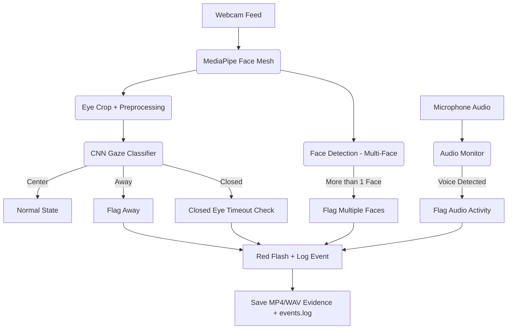

# Exam Gaze Proctor 👀

**Exam Gaze Proctor** is an AI-powered system designed to monitor students during online exams.  
It uses **eye gaze tracking**, **face detection**, and **audio monitoring** to flag potentially suspicious behaviors such as looking away from the screen, keeping eyes closed for too long, the presence of multiple people, or background conversations.  

Built with **TensorFlow, OpenCV, MediaPipe, and SoundDevice**, the project demonstrates how deep learning and computer vision can be applied to real-world proctoring scenarios.

---

## ✨ Key Features

### 🔹 Eye Gaze Tracking
- Classifies gaze into three categories:  
  - **Center** → Looking directly at the screen.  
  - **Away** → Looking left, right, up, or down.  
  - **Closed** → Eyes shut.  
- Powered by a custom-trained CNN on both an open dataset and personal calibration images.  
- Uses **temporal smoothing** and **confidence thresholds** to reduce false positives.

---

### 🔹 Closed-Eyes Timeout
- Detects if the user’s eyes remain closed for an extended duration.  
- **If eyes are closed for >5 seconds:**  
  - Red warning overlay is displayed.  
  - Event is logged in `events/events.log`.  
  - A short MP4 clip is saved as evidence.  
- Helps differentiate between natural blinking and suspicious inactivity.

---

### 🔹 Multi-Face Detection
- Ensures only one face is present in the camera feed.  
- If **more than one face** is detected:  
  - Immediate red flash warning (*MULTIPLE FACES DETECTED!*).  
  - Event is logged with a timestamp.  
  - Video evidence is recorded automatically.  
- Useful to prevent collaboration or proxy test-taking.

---

### 🔹 Audio Monitoring
- Continuously listens through the microphone for **speech or background voices**.  
- If **sustained voice activity** is detected:  
  - Red warning overlay is displayed (*VOICE DETECTED!*).  
  - Event is logged in `events/events.log`.  
  - A short `.wav` audio clip (~5 seconds) is saved as evidence.  
- Prevents students from discussing answers out loud or receiving verbal help.

---

### 🔹 Real-Time Warnings
- During suspicious activity, the student’s screen flashes **red** with a bold warning message:  
  - *LOOKING AWAY!*  
  - *MULTIPLE FACES DETECTED!*  
  - *EYES CLOSED TOO LONG!*  
  - *VOICE DETECTED!*  
- Provides **instant feedback** to discourage further misconduct.  

---

### 🔹 Evidence Logging
- Every suspicious event is logged in the `events/` folder.  
- **Two types of evidence are saved:**  
  1. A line in `events.log` with the timestamp and event type.  
  2. A short **.mp4 video clip** or **.wav audio clip** of the violation.  
- Ensures instructors can review exactly what happened later.

---

### 🔹 Robust Classification
- **Closed ≠ Away** → closed eyes are treated as a separate class.  
- Combines:
  - **Short-term checks** (catch quick closed-eye signals).  
  - **Ratio-based checks** (e.g., away ≥60% of last frames).  
  - **Long-term smoothing** (majority vote across ~25 frames).  
- Results in a system that is stable against natural blinks, quick glances, or small posture changes.

---

## 📂 Project Structure

```
Exam_Proctor/
├── scripts/                # Dataset capture & preprocessing scripts
├── raw_images/             # Personal + open dataset images
├── processed/              # Preprocessed eye crops ready for training
├── model_train.py          # CNN training script
├── infer_realtime.py       # Real-time proctoring system
├── requirements.txt        # Dependencies
├── README.md               # Project documentation
└── events/                 # Logs + MP4 evidence of suspicious events
```

---

## 🔄 System Pipeline


---

## 📊 Current Capabilities

✅ Eye gaze classification (center / away / closed)

✅ Temporal smoothing for stable predictions

✅ Closed-eyes timeout detection (>5s)

✅ Multi-face detection with warnings

✅ Audio monitoring for background voices

✅ Red flash overlay warnings for violations

✅ Evidence logging (event log + MP4/WAV clips)

---

## 🔮 Planned Improvements

⬜ Dataset Expansion → integrate more open datasets to improve CNN generalization

⬜ Cheat Behavior Scenarios → add detection for mobile phone usage, frequent head tilting, etc.

⬜ Instructor Dashboard → centralized log and evidence review system.

⬜ Optional Cloud Sync → store violations securely for remote review. 

---

👨‍💻 Author

Developed by Vathsal Upadhyay (Vatsy05)
💡 Built as a college-level AI/ML project to showcase practical application of CNNs, MediaPipe, and real-time proctoring.